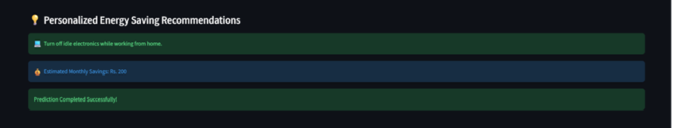

# ⚡ Smart Electricity Consumption Prediction System

## 📖 Project Overview

The **Smart Electricity Consumption Prediction System** is a Machine Learning-based web application developed using **Python** and **Streamlit**. The system predicts the daily electricity consumption of a household based on user-provided information such as house type, appliance usage, weather conditions, and household characteristics.

In addition to predicting electricity consumption, the application provides personalized energy-saving recommendations, estimates monthly electricity bills, and evaluates household energy efficiency.

---

## 🎯 Objectives

The objectives of this project are:

- Predict household daily electricity consumption.
- Estimate monthly electricity usage.
- Estimate monthly electricity bill.
- Provide personalized energy-saving recommendations.
- Improve household energy efficiency using Machine Learning.

---

# ✨ Features

- ⚡ Daily Electricity Consumption Prediction
- 📅 Monthly Electricity Consumption Estimation
- 💰 Monthly Electricity Bill Calculation
- ⭐ Energy Efficiency Score
- 💡 Personalized Energy Saving Recommendations
- 🖥 Interactive Streamlit Web Interface
- 📊 Machine Learning Model Integration

---

# 🛠 Technologies Used

| Technology | Purpose |
|------------|---------|
| Python | Programming Language |
| Streamlit | Web Application |
| Pandas | Data Processing |
| NumPy | Numerical Computation |
| Scikit-learn | Machine Learning |
| Joblib | Model Serialization |
| OpenPyXL | Excel Report Generation |

---

# 📂 Project Structure

```
Smart-Electricity-Consumption/
│
├── README.md
├── main.py
├── requirements.txt
│
├── app/
│   ├── app.py
│   ├── predictor.py
│   ├── recommendation.py
│   └── utils.py
│
├── dataset/
│   ├── electricity_dataset.csv
│   ├── processed_data.csv
│   ├── dataset_generation.py
│   └── dataset_description.md
│
├── models/
│   ├── best_model.pkl
│   ├── scaler.pkl
│   └── encoder.pkl
│
├── notebooks/
│   ├── 01_EDA.ipynb
│   ├── 02_Model_Training.ipynb
│   └── 03_Prediction_Testing.ipynb
│
└── reports/
    ├── Energy_Report.xlsx
    ├── Model_Report.xlsx
    ├── Monthly_Report.csv
    └── Project_Report.docx
```

---

# 📊 Machine Learning Workflow

1. Dataset Collection
2. Data Cleaning
3. Exploratory Data Analysis
4. Feature Engineering
5. Feature Scaling
6. Model Training
7. Model Evaluation
8. Prediction
9. Recommendation Generation
10. Web Application Deployment

---

# 🤖 Machine Learning Models

The following regression algorithms were trained and evaluated.

| Model | MAE | MSE | R² Score |
|------|------|------|---------|
| Linear Regression | 0.56 | 0.45 | 0.99 |
| Decision Tree | 1.32 | 2.87 | 0.96 |
| Random Forest | 0.98 | 1.49 | 0.98 |

**Selected Model:** Linear Regression

---

# 🚀 Installation

Clone the repository:

```bash
git clone <repository-url>
```

Move to the project directory:

```bash
cd Smart-Electricity-Consumption
```

Install dependencies:

```bash
pip install -r requirements.txt
```

Run the project:

```bash
python main.py
```

Or run directly with Streamlit:

```bash
streamlit run app/app.py
```

---

# 📈 Application Outputs

The application provides:

- Daily Electricity Consumption
- Monthly Electricity Consumption
- Estimated Monthly Electricity Bill
- Energy Efficiency Rating
- Personalized Energy Saving Recommendations

---

## 📷 Application Screenshots

### Home Page


---

### Prediction Result


---

### Recommendations



---

# 🔮 Future Enhancements

- User Authentication
- Cloud Deployment
- Real-time Smart Meter Integration
- Deep Learning Models
- Energy Consumption Visualization
- PDF Report Generation
- Historical Usage Tracking

---

# 👨‍💻 Developer

**Mudasir Raza**

Machine Learning & Python Developer

---

# 📜 License

This project is developed for educational and academic purposes.